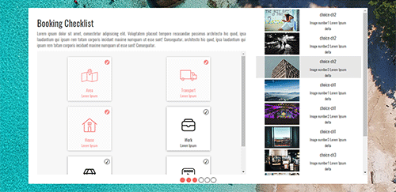

# UI-Prototype
A quick and dirty POC implementation of a sleek UI with JS functionalities

    

### Description:
This is a quick prototype of a UI mockup and its behaviour.

### Frameworks and Libraries Used:
1. Bootstrap
2. Jquery

### Image Credits:
All the images used in the prototype are from [Unsplash](https://unsplash.com/)
